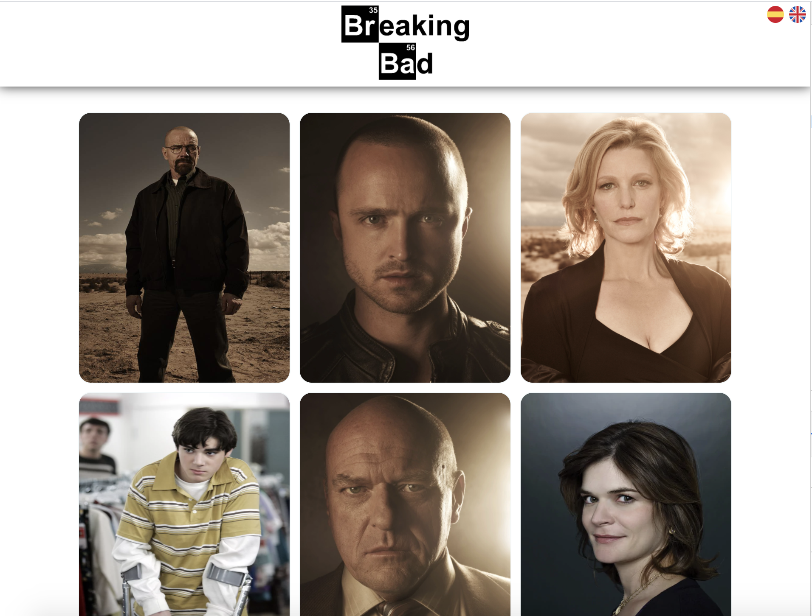

# BreakinBad documentation
This project was bootstrapped with [Create React App](https://github.com/facebook/create-react-app), using the [Redux](https://redux.js.org/).
## Intro

Desarrollar una aplicación con la que se pueda consultar los detalles de los personajes de la serie Breaking Bad. En la web https://breakingbadapi.com/ se expone una API pública para integrar la información requerida.

La aplicación constaría de dos pantallas. En la primera pantalla se listan todos los personajes existentes: cada elemento de la lista mostraría la información mínima necesaria para identificar cada personaje. Una vez que se pulse sobre alguno de ellos, se accedería a la pantalla de detalle, donde se mostraría toda la información que expone la API para ese personaje, además de una frase célebre que haya comentado el personaje durante la historia. Esta frase cambiaría de manera aleatoria cada vez que se accede a la pantalla, o se pulsa sobre un botón que la actualiza.

 ### Requisitos
- Correcta organización del código fuente.  Componentización adecuada.
- Óptima comunicación con el backend. Óptima navegación entre pantallas.
- Gestionar correctamente el feedback de carga de datos y gestión errores (para informar en todo momento al usuario mientras se está realizando una operación u ocurre algún error al efectuarla).
- Dotar a la aplicación de funcionalidad para poner cambiar el idioma entre inglés y español, internacionalizando las cadenas de la propia aplicación (obviamente, las que responden los servicios no).
- A pesar de que se trate de una aplicación simple, puede usar una librería de gestión de estados, como (REDUX) con alguna librería para gestión de efectos (thunk, sagas, observables).
- Incluya algunos tests unitarios que den buena cobertura a determinada funcionalidad de la aplicación.
- Readme debidamente cumplimentado, explicando el proyecto a nivel técnico y funcional.

## ScreenShot

# Technical description
Esta aplicación esta diseñada para ser utilizada en un entorno web, pero esta estructurada y estilizada para adaptarse en otros entornos y dispositivos.

Como ya sabemos, esta creada en ReactJs, con una estructra definida de la siguiente forma:
 - Aplicación (donde renderizamos el Layout y las posibles "vistas" del programa).
 - Views (Son las dos pantallas requeridas en la web)
 - Components (són los componentes que utilizamos en toda la web, desde Layout hasta un spinner)
 - redux (donde se encuentra la estructura completa para la gestión de estados)
 - Styles (estructura de hojas de estilos para definir y proveer al proyecto de ciertas funciones)
 - Helpers y Api (Funciones complementarias para el correcto funcionamiento del proyecto y en gran parte del testing)
 - i18n (para proveer las traducciones)
 - assets (donde se almacenan los elementos gràficos en este caso, para proveer a la web)

 Se ha intentado componetizar el máximo posible, pese a no tener un gran número de componentes se pretende que este proyecto sea escalable y nos sirva para futuras iteraciones.

 Se ha hecho uso de 2 dependencias nuevas a parte de la ya comentada librería de redux, con el siguiente propósito:

- [React-route](https://reactrouter.com/web/guides/quick-start)

    Con esta librería, proveemos a la aplicación de un sistema de rutas para renderizar un elemento u otro dependiendo de la ruta en que nos encontremos en ese momento.

- [i18Next](https://react.i18next.com/)

    En el caso de i18n, utilizamos esta librería para poder realizar uno de los requisitos de la prueba, implementar un sistema de traducciones, he creido conveniente el uso de esta librería ya que es una de las más utilizadas en proyectos de React y por la experiencia previa con ella.

Otros datos técnicos:

- Hojas de estilos Modulares: nos permiten escribir estilos que luego se convertirán en nombres de clase únicos e irrepetibles, compuestos por nombre del archivo, class name y un hash aleatorio, asegurando así un encapsulamiento de estilos completo. Lo que nos evita una vez renderizada la aplicación, la mezcla de estilos con el mismo className. Esto nos permite una nomenclatura mas sencilla y nos evita el uso de otras técnicas para estructurar el código.
También he implementado una estructura de archivos SCSS, para el uso de variables, mixins y una estructura de estilos base para el global de todo el proyecto.

- Uso de estados: como requisito se pedía el uso de Redux para el manejo de estados de la applicación, he optado por el uso de redux (sin redux toolkit), ya que pese a ser lo que utilizo de forma habitual, creo que para una prueba es mejor el uso de redux sin ninguna librería que facilite su uso.
También se ha hecho uso de Middlewares (saga), para realizar las llamadas a la API de forma asíncrona.

- testing: Para testear se ha utilizado [@testing-library/react](https://testing-library.com/docs/react-testing-library/intro/), con la ayuda de algunos helpers para testear componentes con {children}, para proveer de propiedades de traducción o proveer de rutas a los componentes necesarios.
Sin duda ha sido la parte mas dura para mi, debido a mi inexperiencia creando helpers para proveer de servicios a los tests, y también por la falta de tiempo que me ha impedido tener un coverage mas alto.

## Available Scripts

In the project directory, you can run:

### `yarn start`

Runs the app in the development mode. 
Open [http://localhost:3000](http://localhost:3000) to view it in the browser.

The page will reload if you make edits. 
You will also see any lint errors in the console.

### `yarn test`

Launches the test runner in the interactive watch mode. 
See the section about [running tests](https://facebook.github.io/create-react-app/docs/running-tests) for more information.

### `yarn build`

Builds the app for production to the `build` folder. 
It correctly bundles React in production mode and optimizes the build for the best performance.

The build is minified and the filenames include the hashes. 
Your app is ready to be deployed!

See the section about [deployment](https://facebook.github.io/create-react-app/docs/deployment) for more information.

## Learn More

You can learn more in the [Create React App documentation](https://facebook.github.io/create-react-app/docs/getting-started).

To learn React, check out the [React documentation](https://reactjs.org/).
